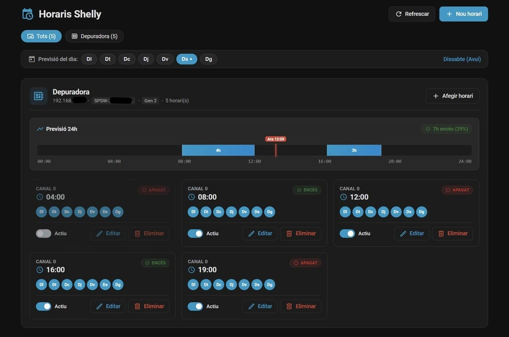

# Shelly Schedules Manager for Home Assistant

[](LICENSE)
[](https://github.com/alemuro/ha-shelly-schedules/releases)
[](https://github.com/hacs/default)
[](https://github.com/alemuro/ha-shelly-schedules/actions/workflows/main.yml)

[](https://my.home-assistant.io/redirect/hacs_repository/?owner=alemuro&repository=ha-shelly-schedules&category=integration)

A comprehensive Home Assistant custom integration that auto-discovers on-device schedules on your **Shelly devices** (both Gen 1 REST and Gen 2/3/Plus/Pro RPC), allowing you to **view, modify, toggle, delete, and create new schedules** directly from Home Assistant without opening each device's web interface or cloud app.



---

## ✨ Features

- **Automatic Device Discovery**: Automatically detects all Shelly devices already configured in your Home Assistant official Shelly integration.
- **Bi-directional On-Device Schedules**:
  - Direct communication with the Shelly hardware (schedules run even if Home Assistant or your Wi-Fi is temporarily down!).
  - Full support for **Gen 2 / Gen 3 / Plus / Pro** devices (`Schedule.List`, `Schedule.Create`, `Schedule.Update`, `Schedule.Delete`).
  - Full support for **Gen 1** devices (`/settings/relay/X` rules).
- **Embedded UI (Sidebar Panel & Lovelace Card)**:
  - Responsive visual management dashboard accessible directly from the HA sidebar (`/shelly-schedules`).
  - Can also be added as a custom Lovelace card: `type: custom:shelly-schedules-card`.
  - **24-Hour Timeline Forecast**: Visual horizontal timeline bar per device/channel displaying continuous ON/OFF intervals across 24h, midnight rollover, day selector, and live real-time indicator.
  - Day selector chips, chronological time sorting, time / sunrise / sunset offset controls, toggle switch, edit modal, and deletion confirmation.
- **Home Assistant Services**:
  - `shelly_schedules.get_schedules`
  - `shelly_schedules.create_schedule`
  - `shelly_schedules.update_schedule`
  - `shelly_schedules.delete_schedule`
  - `shelly_schedules.toggle_schedule`
- **Multi-language Support**: Català, English, and Español.

---

## 📦 Installation

### Option 1: HACS (Recommended)

1. Make sure [HACS](https://hacs.xyz/) is installed in your Home Assistant.
2. Go to **HACS** > **Integrations** > Three dots in top right corner > **Custom repositories**.
3. Add `https://github.com/alemuro/ha-shelly-schedules` with category **Integration**.
4. Click **Download**.
5. Restart Home Assistant.
6. Go to **Settings** > **Devices & Services** > **Add Integration** and search for **Shelly Schedules**.

### Option 2: Manual Installation

1. Download the latest release `.zip` or clone this repository.
2. Copy the `custom_components/shelly_schedules` directory into your Home Assistant `<config>/custom_components/` directory:
   ```bash
   cp -r custom_components/shelly_schedules /path/to/homeassistant/config/custom_components/
   ```
3. Restart Home Assistant.
4. Go to **Settings** > **Devices & Services** > **Add Integration** and select **Shelly Schedules**.

---

## 🖥️ User Interface

### Sidebar Panel
Once the integration is loaded, a **Shelly Schedules** icon appears in your Home Assistant left sidebar (`/shelly-schedules`). Clicking it opens the interactive schedule manager.

### Lovelace Card
You can also embed the schedule manager anywhere inside your Lovelace dashboards:

```yaml
type: custom:shelly-schedules-card
```

---

## 🛠️ Service Examples

### Create a Schedule
```yaml
service: shelly_schedules.create_schedule
data:
  device: "192.168.1.50" # Or friendly name / device id
  time: "07:30"
  action: "on"
  days: [1, 2, 3, 4, 5] # Monday to Friday (0=Sunday, 1=Monday... 6=Saturday)
  channel: 0
  time_type: "time"
  enabled: true
```

### Create a Sunrise / Sunset Schedule
```yaml
service: shelly_schedules.create_schedule
data:
  device: "192.168.1.50"
  time: "@sunset-15m"
  action: "on"
  days: [0, 1, 2, 3, 4, 5, 6]
  channel: 0
  time_type: "sunset"
```

### Toggle an Existing Schedule
```yaml
service: shelly_schedules.toggle_schedule
data:
  device: "192.168.1.50"
  schedule_id: 1
  enabled: false
```

### Delete a Schedule
```yaml
service: shelly_schedules.delete_schedule
data:
  device: "192.168.1.50"
  schedule_id: 1
```

---

## 🧑‍💻 Development

This project uses `uv` for fast Python dependency management and `ruff` for code style.

```bash
# Setup environment & install dependencies
make install

# Run linter & formatter checks
make lint

# Run unit tests
make test
```

---

## 📄 License

This project is licensed under the MIT License - see the [LICENSE](LICENSE) file for details.
